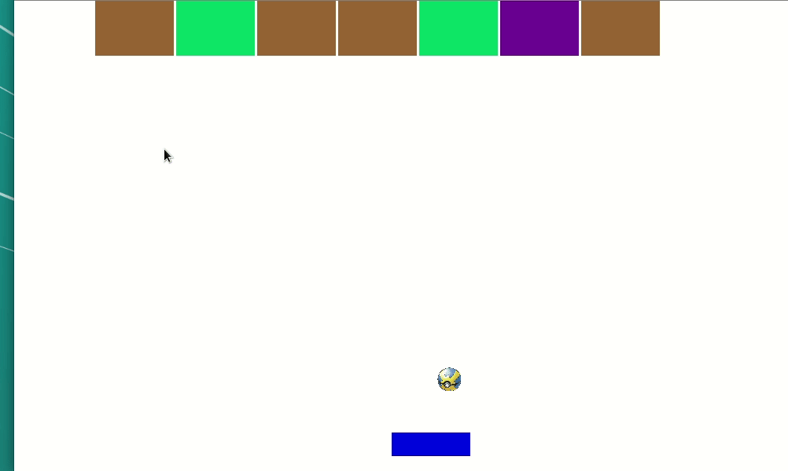

# Casse Briques
Jeu de casse briques créé lors d'un cours de programmation intéractive durant le confinement.



# Jouer

Le jeu fonctionne avec Python3 et la librairie [Pygame](https://www.pygame.org/wiki/GettingStarted)
```bash
# Installation de pygame (requires python3)
python -m pip install pygame
```